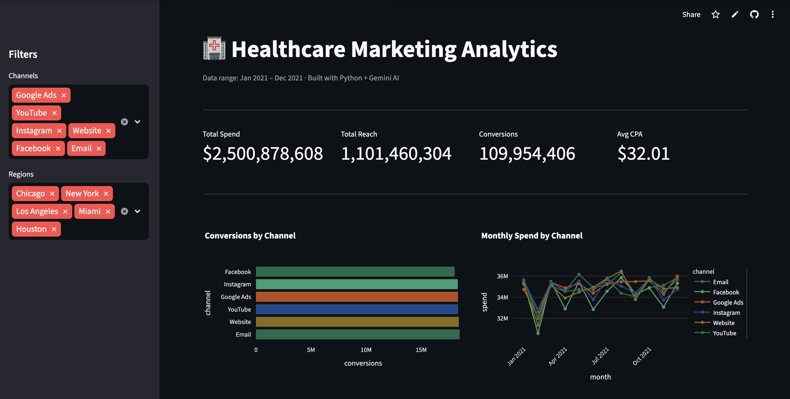

# 🏥 Healthcare Marketing Analytics Dashboard

An AI-powered analytics dashboard that analyses 200,000+ marketing campaign records and lets you ask questions about the data in plain English — powered by Python, Streamlit, and Google Gemini.

🔗 **[View Live App](https://health-marketing-dashboard-9arami72w3klpimbjczwxm.streamlit.app/)**

---

## What it does

- Loads and processes **200,000 rows** of real marketing campaign data
- Displays **4 interactive charts** — channel performance, monthly spend trends, cost per acquisition by segment, and regional conversion heatmap
- **Sidebar filters** let you slice data by channel and region in real time
- **AI Analyst panel** — type any question in plain English and Google Gemini answers using the actual data as context

---

## Screenshots



---

## Tech Stack

| Tool | Purpose |
|---|---|
| Python 3.10+ | Core language |
| Streamlit | Web app framework |
| pandas | Data loading and transformation |
| Plotly | Interactive charts |
| Google Gemini API | AI analyst (natural language Q&A) |
| python-dotenv | Environment variable management |

---

## Project Structure

```
health-marketing-dashboard/
├── app.py               # Main Streamlit app
├── data_loader.py       # Loads and cleans CSV data
├── ai_analyst.py        # Handles Gemini API calls
├── charts.py            # All chart functions
├── requirements.txt     # Python dependencies
├── .env                 # API key (never committed)
├── .gitignore           # Ignores .env and venv
└── data/
    └── health_marketing.csv  # Dataset (200k rows)
```

---

## Data

Uses the [Marketing Campaign Performance Dataset](https://www.kaggle.com/datasets/manishabhatt22/marketing-campaign-performance-dataset) from Kaggle — 200,000 records across multiple channels, regions, demographics and campaign types.

**Key columns used:**
- `Channel_Used` → marketing channel (Email, Social Media, Google Ads etc.)
- `Acquisition_Cost` → spend per campaign
- `Impressions` → total reach
- `Clicks` → used as conversion proxy
- `Location` → regional breakdown
- `Target_Audience` → age segment

---

## Key Learnings

Building this project taught me:
- How to build and deploy a full Python web application end-to-end
- Connecting a data pipeline to an LLM API (Google Gemini)
- pandas data transformation — groupby, aggregation, cleaning real-world messy data
- Streamlit for rapid interactive dashboard development
- Git and GitHub for version control and deployment

---

## Author

**Pranali Kulkarni**
Data Analyst transitioning into AI/ML Engineering

[LinkedIn](https://www.linkedin.com/in/pranalikulkarni) · [GitHub](https://github.com/pranalivk14)
